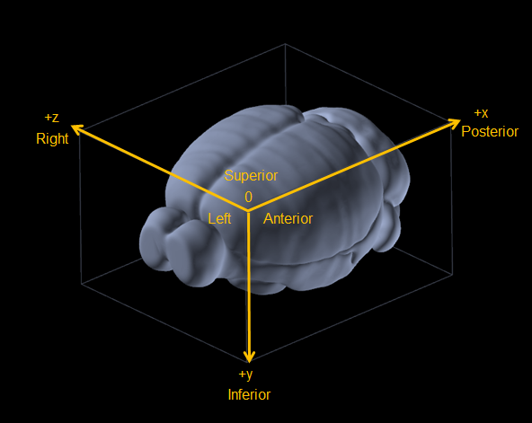

# ABBA

## ABBA and Brainglobe atlases

!!! info "TL; DR"

    What do I do to configure `cuisto` properly depending on the atlas and software used ? Check [the section below](#cuisto-configuration).

Atlases, and especially their coordinates systems, are very important for any downstream processing because both users and softwares need to be aware of which axes correspond to which anatomical directions.

Furthermore, programming language and libraries do not always use the same convention as to how order arrays (3D images numerical representation). Finally, some atlases, such as the 3D version of the mouse spinal cord atlas, are not isotropic (the voxels are not cubic).

!!! quote "Nicolas Chiaruttini, ABBA developper, in a [post](https://forum.image.sc/t/spinal-cord-atlas-appears-squashed-in-abba-python/96242/15)"
    Sure, we’ve got all the ingredients for a disaster: the counter intuitive zyx convention for numpy, that has to be mixed with xyz in java, a strange choice of axis for the Allen Brain atlas, and anisotropic atlases. Hopefully we don’t design medical devices...

The following shows the convention used by the Allen Brain Atlas, the Common Coordinates Framework :



### ABBA convention
Atlases provided by ABBA, namely "Allen Brain Atlas V3p1", follow the CCFv3 convention but slices are assumed to be facing downwards, eg. what you see on the left on the screen is considered to be on the right of the animal. It has the the following consequences :

1. Importing registered regions in QuPath will result in regions on the **left** having the classification "**Right**: region-name".
2. Medio-lateral (left/right) coordinates **decreases** from left to right.

Point 1. is mitigated in Groovy scripts bundled with `cuisto` : scripts used to import ABBA registration have an option `mirrorLeftRight` allowing for Left/Right swap. This is OK as the Allen Brain is symmetrical by construction.  
Point 2. is taken into account in `cuisto`, that detects the hemisphere in which an object is based on the medio-lateral coordinate -- using the atlas "type" parameter in the [configuration](#cuisto-configuration).

As a side note, ABBA is developped in Java, which uses a x, y, z convention. That means that the first coordinate in ABBA stays the first coordinate in QuPath called Atlas_X and corresponds to the antero-posterior (rostro-caudal) anatomical axis.

!!! info

    Following [extensive discussion](https://github.com/BIOP/abba_python/pull/21), yet another atlas was released : "allen_mouse_10um_java". It is the same as the default "Allen Brain Atlas V3p1", but repackaged so it follows the [Brainglobe convention](#brainglobe-convention). This particular atlas should be treated as a "brainglobe" atlas in [`cuisto` configuration](#cuisto-configuration).

### Brainglobe convention
!!! info

    If using regular ABBA from Fiji but using the "allen_mouse_10um_java" atlas, this section applies.

Brainglobe follows the Python/napari/numpy convention for indexing : TCZYX (time, channels, z, y, x). In our case, we can ignore time and channel, keeping the zyx convention. But taking the Allen Brain volume, it considers the antero-posterior direction as \(z\) axis, the dorso-ventral direction as \(y\) axis and the medio-lateral direction as the \(x\) axis.

In other word, for querying the region of a given location using the `structure_from_coords()` method which can be used like this :
```python
atlas.structure_from_coords((i, j, k), microns=True)
```
where `(i, j, k)` is a triplet of coordinates :

- `i` is axis 0, eg. rostro-caudal,
- `j` is axis 1, eg. dorso-ventral,
- `k` is axis 2, eg. medio-lateral.

This looks like CCFv3 and thus ABBA convention, but it deviates in that the axes *names* are :

- `z` is axis 0, eg. rostro-caudal,
- `y` is axis 1, eg. dorso-ventral,
- `x` is axis 2, eg. medio-lateral.

This causes a mismatch when using a Brainglobe atlas in ABBA through [abba_python](guide-install-abba.md#abba-python). The consequences are :

1. First coordinate "Altas_X" is the medio-lateral axis.
2. Third coordinate "Atlas_Z" is the rostro-caudal axis.
3. The medio-lateral coordinate, "Atlas_X", **increases** from left to right.

Those points are all taken into account in `cuisto` using the atlas "type" parameter in the [configuration](#cuisto-configuration). 

!!! warning

    No matter the atlas nor the software (ABBA-Fiji or ABBA-Python), ABBA will always consider slices to be facing downward, thus inverting the Left/Right hemispheres *for annotations only*, but not necessarily the objects' atlas coordinates.

### `cuisto` configuration

The main `cuisto` [configuration file](main-configuration-files.md#configtoml) has an `[atlas]` section, in which there is a `type` parameter.

```toml title="config_template.toml" hl_lines="3"
--8<-- "configs/config_template.toml:21:25"
```

Configure like so :

- If using the "Allen Brain Atlas V3p1" atlas, set `type = "abba"`.
- If using any Brainglobe atlases from abba_python, or the "allen_mouse_10um_java" atlas, set `type="brainglobe`.

In any event, when importing atlas regions into QuPath with the ABBA extension from the scripts located in `scripts/qupath-utils/atlas`, set `mirrorLeftRight` to `true`. This ensures the regions (annotations) are correctly classified with the correct hemisphere (eg. the left hemisphere is the left part of what you see on the screen).

The `type` parameter is read to handle axes names ("Atlas_X" and "Atlas_Z"), determine how to extract detections hemisphere and how to plot spatial distributions.

Here is a summary table :

| **\\**                                    | IJ + Allen Brain Atlas V3p1 | IJ + allen_mouse_10um_java | python + allen_mouse_10um | python + allen_mouse_10um_java |
|------------------------------------------|-----------------------------|----------------------------|---------------------------|--------------------------------|
| **First coordinates X**                  | AP                          | ML                         | ML                        | ML                             |
| **Third coordinates Z**                  | ML                          | AP                         | AP                        | AP                             |
| **Side when atlas medio-lateral < 5700** | right                       | left                       | left                      | left                           |
| **Annotations side on left**             | right                       | right                      | right                     | right                          |
| **`mirrorLeftRight` for Annotations**      | true                         | true                        | true                       | true                            |
| **`cuisto` configuration atlas type**      | "abba"                        | "brainglobe"                 | "brainglobe"                | "brainglobe"                     |
